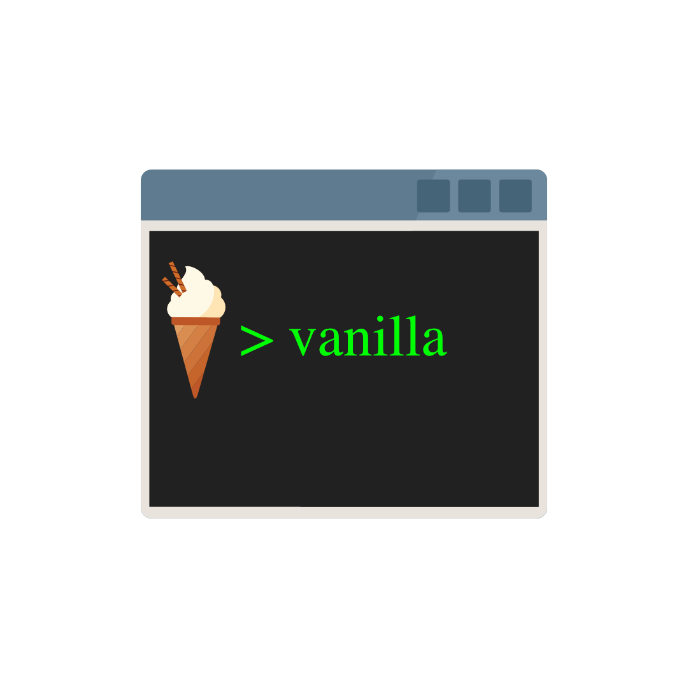

<h1 align="center">

</h1>

<h1 align="center">VANILLA-CONE</h1>

😋 🍦 🚀

    
    
    

<strong>Vanilla-cone allows you to create a javascript vanilla folder which contains .html, .css and .js file with the href link and the src script already filled !</strong>

🤔 I imagine that like me you are lazy and you like things to be done in a finger snap.

➡️ You have come to the right place ! With this command line, no more wasting time. ⏲️ 😎

 

✅ Vanilla quality certified, good tasting! 😋 🍦

 

<h1>What’s In This Document</h1>

- <a href="#installation">Installation</a>
- <a href="#usage">Usage</a>
- <a href="#contribute">How to Contribute</a>
- <a href="#license">License</a>
- <a href="#thanks">Thanks</a>

<h1 id="installation">👷 Installation</h1>

To install js-vanilla, run this command line in your terminal:

    npm install js-vanilla -g

<h1 id="usage">🎓 Usage</h1>

Run this command in your terminal:

    vanilla

Then answer the questionnaire to personalize your ice cream:
   Example:

    js-vanilla: Folder name ?:  (vanilla-1) Shop
    js-vanilla: What name do you want to give to your .html file ?:  (index) cart
    js-vanilla: What name do you want to give to your .css file ?:  (styles) css-styles
    js-vanilla: What name do you want to give to your .js file ?:  (main) js-main

If you do not answer, the values in brackets will be taken by default.

 

Run this command in your terminal if you don't want to personalize your ice cream and receive vanilla ice cream by default 🍦

    vanilla -y

<h1 id="contribute">🤝 How to Contribute</h1>

Whether you want to help fix bugs, improve the documentation or spread the word, it will be a pleasure to taste this vanilla ice cream together. 💪 🍦 ❤️

Do not hesitate to take a look at the <a href="https://github.com/mrwaks/js-vanilla" target="_blank">github repository of js-vanilla</a>.

For any questions or suggestions do not hesitate to write to<a href="mailto: rudy.waks@gmail.com"> rudy.waks@gmail.com</a>.

<h1 id="license">📝 License</h1>

Licensed under <a href="https://github.com/mrwaks/js-vanilla/blob/main/license" target="_blank">the MIT License</a>.

<h1 id="thanks">❤️ 😋 Thanks and bon appetit !</h1>

Thank you in advance for your tasting, don't forget to take a napkin and a spoon... 🥄 🍦
